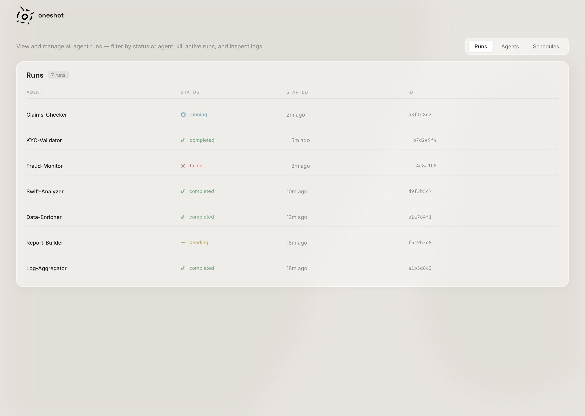
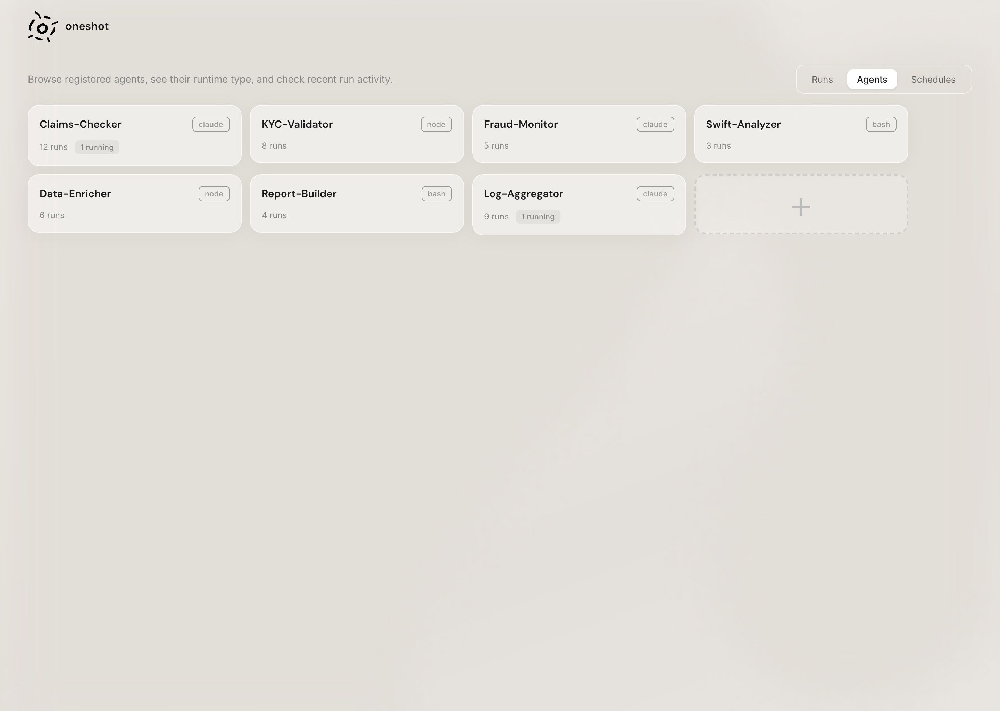
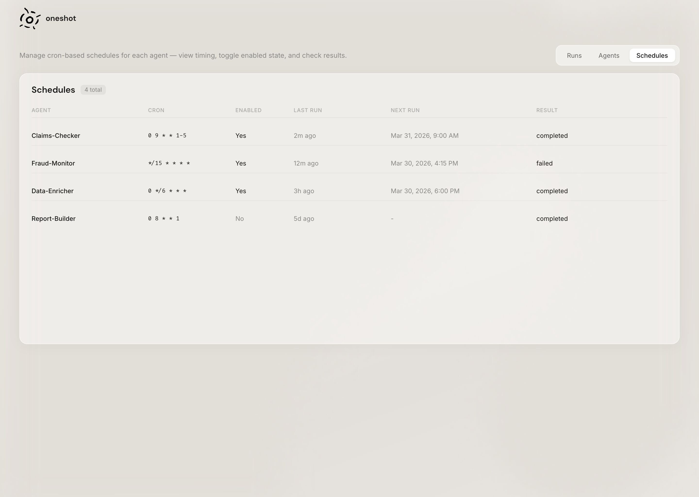
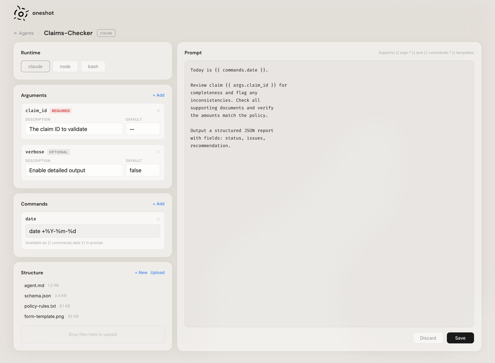

<p align="center">
  
</p>

<h3 align="center">oneshot</h3>

<p align="center">
  Agent execution platform for VPS environments — define agents as Markdown, run them via API or CLI.
</p>

---

Oneshot is built for running autonomous agents on remote servers. Define agents as simple Markdown files — Claude prompts, Codex prompts, Node.js scripts, or Bash scripts — and fire them off on-demand or on a cron schedule through a REST API, CLI, or web dashboard. Deploy it on a VPS and use it as the backbone for your agent infrastructure.

## Install

```bash
git clone https://github.com/troels-a/oneshot.git
cd oneshot
npm run setup
```

The setup wizard creates your `.env` with generated credentials, installs dependencies, and links the `oneshot` CLI globally.

## Usage

```bash
npm run start   # Starts both the API server and dashboard
```

- **API** at `http://localhost:3000`
- **Dashboard** at `http://localhost:5173`

## Dashboard









## Creating an Agent

Agents live in the `agents/` directory. Each agent is a folder with an `agent.md` file:

```
agents/
  my-agent/
    agent.md
```

The file uses YAML frontmatter for config, and the body is the program:

```yaml
---
runtime: claude
args:
  - name: topic
    description: What to research
    required: true
commands:
  - name: date
    run: "date +%Y-%m-%d"
---

Today is {{ commands.date }}. Research {{ args.topic }} and write a summary.
```

#### Worktree isolation

Add `worktree: true` to the frontmatter to run each invocation in an isolated git worktree branch. This prevents concurrent runs from interfering with each other.

### Runtimes

| Runtime | Body is | Best for |
|---------|---------|----------|
| `claude` | A prompt passed to `claude -p` | Tasks needing an AI agent with tool access |
| `codex` | A prompt passed to `codex exec` | Tasks needing a Codex coding agent |
| `node` | JavaScript executed via `node` | Programmatic / API tasks |
| `bash` | A shell script executed via `bash` | Shell automation |

### Args and Commands

**Args** are declared in frontmatter and interpolated with `{{ args.name }}`. They can be required, optional, or have defaults.

**Commands** run shell commands at prep time. Results are available as `{{ commands.name }}` — useful for injecting dates, git info, or system state.

### Agent Spawning

Agents can spawn follow-up agents by writing JSON files to `$ONESHOT_SPAWN_DIR`. This environment variable is set automatically for every run and points to a run-specific directory.

Spawned agents dispatch after the parent run completes. JSON format:

```json
{
  "agent": "next-agent-name",
  "args": { "key": "value" },
  "path": "my-project",
  "timeout": 300
}
```

- `agent` (required) — name of the agent to dispatch
- `args` — arguments to pass to the spawned agent
- `path` — working directory for the spawned run
- `timeout` — timeout in seconds

### Run Environment Variables

Every agent run receives these environment variables:

| Variable | Description |
|----------|-------------|
| `ONESHOT_SPAWN_DIR` | Directory for writing spawn request files |
| `ONESHOT_RUN_ID` | Unique ID for the current run |
| `ONESHOT_AGENT` | Name of the agent being run |
| `ONESHOT_PATH` | Working directory (if `--path` was provided) |
| `ONESHOT_BRANCH` | Git branch name (if worktree mode is active) |

## CLI

```bash
oneshot list                          # List all agents
oneshot info my-agent                 # Show agent details
oneshot run my-agent --topic=value    # Run an agent
oneshot run my-agent --path=dir       # Run in a specific directory
oneshot schedule my-agent "0 9 * * *" # Create a cron schedule
oneshot schedules                     # List all schedules
oneshot clear                         # Clear completed/failed runs
```

## API

All endpoints require `Authorization: Bearer $ONESHOT_API_KEY`.

### Agents

```
GET    /agents                        # List agents
GET    /agents/:agent                 # Get agent details
POST   /agents                        # Create agent
PUT    /agents/:agent                 # Update agent
DELETE /agents/:agent                 # Delete agent
```

### Dispatch

```
POST   /agents/:agent/dispatch        # Run an agent
```

```bash
curl -X POST http://localhost:3000/agents/my-agent/dispatch \
  -H "Authorization: Bearer $ONESHOT_API_KEY" \
  -H "Content-Type: application/json" \
  -d '{"args": {"topic": "web frameworks"}, "path": "my-project", "timeout": 300}'
```

Only one instance of an agent runs at a time. Returns `409` if already running.

### Runs

```
GET    /runs                          # List runs (filter: ?status=running&agent=name)
GET    /runs/:id                      # Get run details
GET    /runs/:id/logs                 # List log files
GET    /runs/:id/logs/:file           # Stream log content (?offset=0&limit=50)
POST   /runs/:id/stop                 # Stop a running agent
DELETE /runs                          # Clear completed/failed runs
```

### Schedules

```
GET    /schedules                             # List all schedules
POST   /agents/:agent/schedules               # Create schedule
GET    /agents/:agent/schedules               # List agent schedules
GET    /agents/:agent/schedules/:id           # Get specific schedule
PATCH  /agents/:agent/schedules/:id           # Update schedule
DELETE /agents/:agent/schedules/:id           # Delete schedule
```

```bash
curl -X POST http://localhost:3000/agents/my-agent/schedules \
  -H "Authorization: Bearer $ONESHOT_API_KEY" \
  -H "Content-Type: application/json" \
  -d '{"cron": "0 9 * * 1-5", "options": {"args": {"topic": "daily"}}}'
```

### Files

```
GET    /agents/:agent/files           # List agent files
GET    /agents/:agent/files/:file     # Get file content
POST   /agents/:agent/files           # Create file
PUT    /agents/:agent/files/:file     # Update file
DELETE /agents/:agent/files/:file     # Delete file
POST   /agents/:agent/files/upload    # Upload file (multipart, 5MB limit)
```

### Other

```
GET    /health                        # Health check (no auth)
POST   /auth/login                    # Dashboard login (returns JWT)
GET    /stats                         # Run statistics
```

## Project Structure

```
packages/
  core/         Shared library — agent discovery, parsing, execution
  cli/          CLI tool (oneshot list|info|run|clear)
  server/       Express REST API with cron scheduling
  dashboard/    React web UI (Vite)
agents/         Your agent definitions
```

## Environment

Configure in `.env` (created by `npm run setup`):

| Variable | Description | Default |
|----------|-------------|---------|
| `ONESHOT_API_KEY` | Bearer token for API auth | Generated |
| `ONESHOT_DASHBOARD_PASSWORD` | Password for dashboard login | Generated |
| `ONESHOT_API_PORT` | Server port | `3000` |
| `ONESHOT_AGENTS_DIR` | Path to agents directory | `./agents` |
| `ONESHOT_WORKSPACE_DIR` | Base directory for dispatch `--path` | — |

## Development

```bash
npm run api          # Start API server only
npm run dashboard    # Start dashboard only
npm run start        # Start both
npm test             # Run all tests
```
